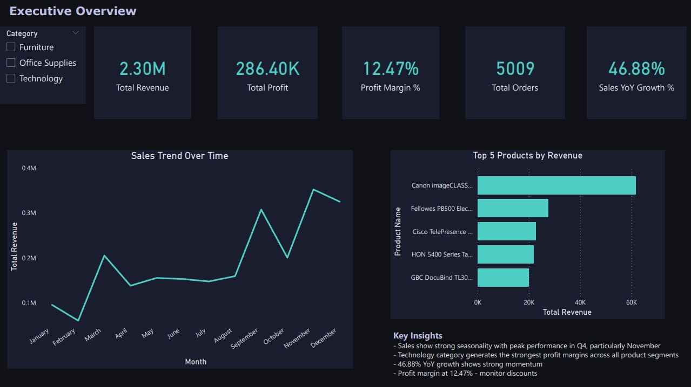

Superstore Sales Intelligence Dashboard

Executive decision-support dashboard analyzing $2.3M in global retail sales data built in Power BI.

Preview

Pages
- Executive Overview - KPIs, sales trend, top products by revenue
- Performance Deep Dive - category, sub-category, regional and profitability analysis
- Forecasting and Insights - 12-month sales forecast and Key Influencers analysis

Key Findings
- Discount levels are the primary driver of profit loss - eliminating discounts increases average profit by 73.56 units 
- Technology category generates the strongest profit margins despite not leading in total sales volume 
- Sales show strong seasonality with peak performance in Q4, particularly November

Tools
Power BI | DAX | Data Modeling
